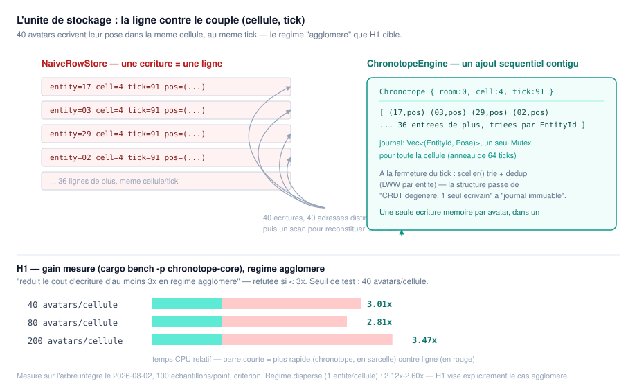
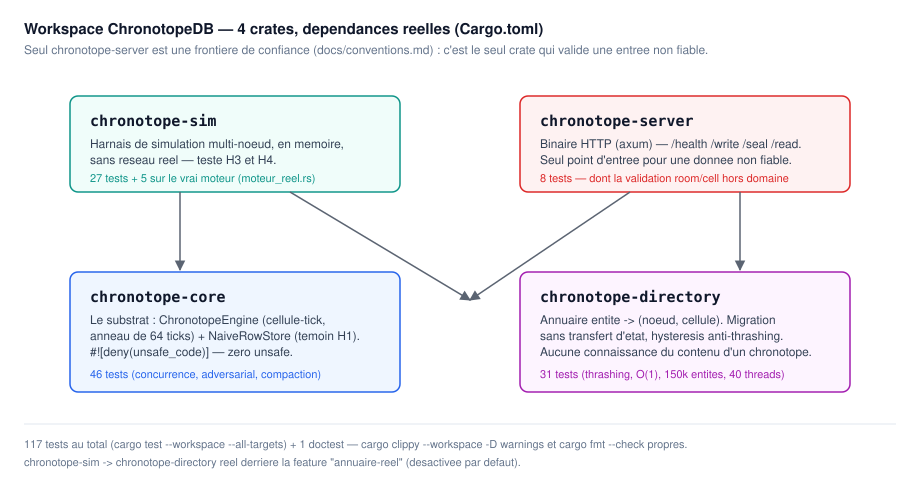
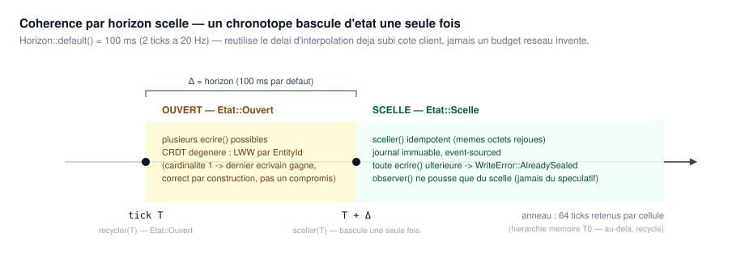

# ChronotopeDB

Substrat de stockage spatio-temporel pour l'état temps réel à cardinalité
d'écriture 1 (poses d'avatars, transformations d'objets tenus) dans un
métavers persistant. Complète un système transactionnel classique
(économie, inventaire, propriété) sans le remplacer — il ne gère jamais de
donnée à plusieurs écrivains concurrents.

Conçu à l'origine pour [PawChat](https://github.com/mairie-creusot/pawchat),
qui utilise [SpacetimeDB](https://spacetimedb.com) comme système
transactionnel de référence. **Ce dépôt ne remplace pas SpacetimeDB** — voir
[`docs/chronotope.md`](docs/chronotope.md) pour l'arbitrage exact (§1, la
frontière par cardinalité d'écriture).

**Statut : validé par les faits (H1/H3/H4 mesurées sur le vrai moteur,
torture-testé, frontière HTTP authentifiée et observable), déployé et exposé
en production (`https://pawchat.<domaine>/chronotope`) mais pas encore
consommé par aucun service.** Voir
[Ce que ce dépôt garantit](#ce-que-ce-dépôt-garantit--et-ne-garantit-pas)
plus bas pour une lecture honnête, sans marketing, de ce qui tient et de ce
qui ne tient pas.

## L'idée en une phrase

L'unité de stockage n'est pas la ligne, c'est le couple **(cellule
spatiale, tick logique)** : un chronotope contient l'état empaqueté de
toutes les entités d'une cellule à un instant, ce qui transforme des
écritures aléatoires en ajouts séquentiels contigus — et bascule, un délai
Δ après son tick, d'un CRDT dégénéré (écrivain unique) vers un journal
immuable.



Voir [`docs/chronotope.md`](docs/chronotope.md) pour le concept complet,
avec ses hypothèses falsifiables (H1-H4) et ses modes d'échec connus —
lecture nécessaire avant de toucher au code. Voir
[`docs/conventions.md`](docs/conventions.md) pour les règles d'ingénierie
(frontière de confiance, `unsafe`, tests, logging).

## Architecture



| Crate | Rôle | Tests |
|---|---|---|
| [`chronotope-core`](crates/chronotope-core) | Le substrat : `ChronotopeStore` (trait), `ChronotopeEngine` (implémentation cellule-tick, anneau de 64 ticks/cellule), `NaiveRowStore` (témoin de comparaison pour H1). `#![deny(unsafe_code)]`. | 46 |
| [`chronotope-directory`](crates/chronotope-directory) | Annuaire entité → (nœud, cellule), migration **sans transfert d'état**, hystérésis anti-thrashing. | 31 + 1 doctest |
| [`chronotope-sim`](crates/chronotope-sim) | Harnais de simulation multi-nœud en mémoire (sans réseau réel) pour tester H3 (migration) et H4 (dégradation sous charge), contre un double **et** contre le vrai moteur. | 32 |
| [`chronotope-server`](crates/chronotope-server) | Binaire HTTP (axum) exposant `ChronotopeEngine` — `/health` `/write` `/seal` `/read` `/metrics`. Seule frontière de confiance du dépôt : authentification, métriques, filet de résilience. | 32 |

**141 tests** (`cargo test --workspace --all-targets`) + 1 doctest, tous
verts. `cargo clippy --workspace --all-targets -- -D warnings` et
`cargo fmt --all -- --check` propres. `cargo audit --deny warnings` : **0
vulnérabilité sur 167 dépendances**.

## Ce que ce dépôt garantit — et ne garantit pas

Issu d'une passe de torture-test dédiée (4 agents indépendants : concurrence
du moteur, fuzzing HTTP, adversarial sur l'annuaire, audit dépendances/CI)
puis d'une passe de durcissement de la frontière HTTP (authentification,
observabilité, résilience), chaque ligne ci-dessous correspond à un test
réel, pas à une intention.

**Garanti, mesuré :**

- Pas de duplication ni de perte d'entité sous migration répétée entre
  cellules (H3, `chronotope-sim/tests/moteur_reel.rs` et `annuaire_reel.rs`,
  contre le **vrai** `ChronotopeEngine` et le **vrai** `Directory`).
- La dégradation de cadence (20 → 10 → 5 Hz) sous charge reste strictement
  locale à la cellule surchargée — la voisine calme ne perd jamais rien
  (H4, mêmes fichiers).
- Aucune écriture n'est jamais refusée par la dégradation (`ecritures_rejetees
  == 0` sous H4) — la dégradation ralentit le scellement, jamais l'accueil.
- `sceller()` est idempotent même sous 12 threads qui le rappellent en
  boucle sur la même clé pendant que d'autres écrivent (60 appels
  concurrents → un seul `Chronotope`, identique bit à bit).
- Aucune corruption ni deadlock sous 40 threads mixtes (`ecrire`/`sceller`/
  `lire`/`observer`), y compris pendant le recyclage de l'anneau.
- **Toute route qui touche le moteur (`/write` `/seal` `/read` `/metrics`)
  exige un secret partagé** (`Authorization: Bearer <secret>`, comparaison à
  temps constant) — le process refuse de démarrer si ce secret n'est pas
  configuré (fail-closed, aucun mode dev permissif). `/read` est protégée
  au même titre que `/write` : des poses lisibles sans authentification
  permettraient de suivre n'importe qui dans n'importe quelle salle.
- Un `room`/`cell` hors domaine envoyé en HTTP est rejeté (`400`), jamais
  transmis au moteur — avant correctif, cette entrée faisait paniquer un
  `assert!` interne et tuait la connexion de l'appelant.
- **`/metrics` (Prometheus) est protégée par le même secret** que les
  routes d'écriture/lecture — contrairement au `/metrics` de SpacetimeDB,
  dont le middleware d'auth est resté un TODO jamais branché.
- **Un filet de résilience** (`tower::limit::ConcurrencyLimitLayer` +
  `LoadShedLayer`, plafond configurable, `503` immédiat au-delà) protège le
  moteur d'un appelant interne buggé (boucle sans backoff) ; `/health` reste
  en dehors de cette couche et répond même quand le reste est saturé
  (`sante_repond_pendant_la_saturation`).
- 150 000 entités dans l'annuaire, migration à `Tick(0)` répétée 5000×, tick
  à `u64::MAX` : aucun overflow, aucune incohérence dans `instantane()`.
- Image Docker : **4.44 Mo** (budget CI 80 Mo), utilisateur non-root,
  `HEALTHCHECK` actif, `cargo audit` propre, actions CI épinglées à un SHA.

**Ne garantit pas, par conception (pas un défaut à corriger) :**

- **Aucune persistance.** `ChronotopeEngine` est purement en mémoire — un
  crash perd tout l'anneau. C'est un choix assumé (`docs/chronotope.md` §6,
  la donnée est un cache de fraîcheur, pas un registre) et pas encore
  compensé par une couche T1/T2 (hors périmètre de ce dépôt). SpacetimeDB
  (`crates/durability`, `crates/commitlog`, `crates/snapshot` du fork
  PawChat) résout un problème que ChronotopeDB n'a délibérément pas.
- **Fenêtre de rétention bornée.** Chaque cellule ne retient que les 64
  derniers ticks scellés (`ChronotopeEngine::ticks_retenus()`) — interroger
  un tick plus ancien renvoie un chronotope vide, pas une erreur. C'est la
  hiérarchie mémoire par âge (§6), pas un bug.
- **Aucune identité multi-utilisateur (pas d'OIDC/JWT façon `Identity`
  SpacetimeDB).** `chronotope-server` n'a qu'une seule classe d'appelant
  légitime prévue (un service interne, pas des utilisateurs finaux à droits
  différenciés) — un secret partagé fail-closed couvre exactement ce modèle
  de menace. Introduire un IdP pour distinguer des identités qui n'existent
  pas serait de la complexité sans bénéfice.
- **Aucune suppression d'entité dans l'annuaire.** `Directory` grossit
  indéfiniment si des entités quittent définitivement le monde — signalé
  par la passe de torture-test, pas corrigé (décision de contrat public à
  prendre délibérément, pas un oubli).
- **Pas de quotas par tenant.** ChronotopeDB n'a pas de notion de "module"
  ni de déploiement multi-tenant (SpacetimeDB Cloud) — un seul déploiement,
  un seul domaine de confiance ; une salle (`RoomId`) n'est pas un tenant.
- **Pas de rate-limiting distribué.** Le filet de résilience (`/metrics`
  ci-dessus) est mono-process, comme `src/lib/rateLimit.ts` de PawChat pour
  un besoin similaire — un seul conteneur, ça suffit.
- **Pas de TLS dans `chronotope-server` lui-même.** Reste le travail d'un
  reverse proxy (Caddy en dev, Traefik en prod — voir
  [Docker](#docker)), cohérent avec le "zéro dépendance TLS" déjà mesuré
  (image 4.44 Mo, aucun appel HTTPS sortant).
- **Pas de vrai réseau distribué.** `chronotope-sim` prouve la logique de
  migration et de dégradation en mémoire ; il n'y a aucune implémentation de
  transport distribué ou de consensus réseau dans ce dépôt.
- **H2 (cohérence imperceptible) n'est pas mesurée ici** — elle exige des
  tests humains en A/B, explicitement hors périmètre de ce dépôt.
- **Résidu connu, non éliminé :** un afflux extrême d'entités **distinctes**
  dans une seule cellule (dizaines de milliers, avant scellement) reste en
  coût non strictement linéaire — un correctif de torture-test a réduit le
  facteur constant d'environ 256×, sans changer la classe de complexité.
  Improbable à une population réaliste, documenté dans
  `crates/chronotope-core/src/engine.rs`.

## Hypothèses falsifiables — état mesuré



| # | Énoncé | Réfutée si | Statut |
|---|---|---|---|
| H1 | L'écriture par trame réduit le coût d'écriture ≥ 3× en régime agglomérant | Gain mesuré < 3× | **Tient** au point de test (40 avatars/cellule : **3.01×**) — voir réserve méthodologique ci-dessous |
| H2 | La cohérence par horizon est imperceptible à l'usage | Test A/B humain | Hors périmètre de ce dépôt (nécessite des sujets humains) |
| H3 | La migration sans transfert d'état n'introduit aucun artefact (duplication/perte/glitch) | Taux de glitch > bascule classique | **Tient** — 0 duplication, 0 perte sur le vrai moteur + le vrai annuaire, latence de bascule bornée par l'hystérésis |
| H4 | La dilatation par cellule bat un plafond global dur | Cadence non locale à la cellule chargée | **Tient** — dégradation en escalier 20→10→5 Hz, strictement locale, sur le vrai moteur |

Mesures H1 réelles (`cargo bench -p chronotope-core`, 100 échantillons,
`criterion`, arbre intégré) :

| Régime | 30/40 | 80 | 200 |
|---|---|---|---|
| Dispersé (1 entité/cellule) | — | 2.12× | 2.60× |
| **Agglomérant (H1)** | **3.01×** | 2.81× | 3.47× |
| Social (mixte réaliste) | 2.45× | 2.70× | 2.66× |

**Réserve méthodologique honnête** : le contrat `ChronotopeStore::ecrire`
est figé à une écriture par entité — le benchmark ne peut donc mesurer que
le surcoût par insertion, pas l'avantage théorique complet
(N écritures effondrées en 1 seul scellement). Le vrai gain du concept en
régime agglomérant est probablement architecturalement invisible à ce
banc de mesure précis.

## `chronotope-server` — API HTTP

Harnais HTTP volontairement simple (pas WebTransport) pour tester le moteur
depuis l'extérieur du process. Port par défaut `3200` (`PORT` pour
surcharger). **Exige `CHRONOTOPE_INTERNAL_SECRET`** au démarrage — le
process refuse de démarrer sans lui (voir [Sécurité](#sécurité)). Toutes les
routes sauf `/health` exigent `Authorization: Bearer <secret>`.

```bash
curl http://localhost:3200/health
# {"ok":true,"service":"chronotope-server"}

curl -X POST http://localhost:3200/write \
  -H "Authorization: Bearer $CHRONOTOPE_INTERNAL_SECRET" \
  -H "Content-Type: application/json" \
  -d '{"room":0,"cell":0,"tick":0,"entity":1,"pos":[1.0,2.0,3.0],"yaw":0.5}'
# {"ok":true,"error":null}

curl -X POST http://localhost:3200/seal \
  -H "Authorization: Bearer $CHRONOTOPE_INTERNAL_SECRET" \
  -H "Content-Type: application/json" \
  -d '{"room":0,"cell":0,"tick":0}'
# {"room":0,"cell":0,"tick":0,"sealed":true,"entity_count":1}

curl "http://localhost:3200/read?room=0&cells=0&tick=0" \
  -H "Authorization: Bearer $CHRONOTOPE_INTERNAL_SECRET"
# {"count":1}

curl "http://localhost:3200/metrics" \
  -H "Authorization: Bearer $CHRONOTOPE_INTERNAL_SECRET"
# # HELP chronotope_requests_total Nombre de requetes par route et resultat.
# # TYPE chronotope_requests_total counter
# chronotope_requests_total{route="write",result="ok"} 1
# ...

# Sans le header : rejet propre, jamais transmis au moteur.
curl -i "http://localhost:3200/write"
# HTTP/1.1 401 Unauthorized
# WWW-Authenticate: Bearer

# room/cell hors domaine (room < 65536, cell < 4096) : rejet propre lui aussi.
curl -i -X POST http://localhost:3200/write \
  -H "Authorization: Bearer $CHRONOTOPE_INTERNAL_SECRET" \
  -H "Content-Type: application/json" \
  -d '{"room":99999,"cell":0,"tick":0,"entity":1,"pos":[0,0,0],"yaw":0}'
# HTTP/1.1 400 Bad Request
```

`cells` sur `/read` accepte une liste séparée par des virgules ; toute
valeur non numérique ou hors domaine est silencieusement écartée plutôt que
de faire échouer la requête.

### Variables d'environnement

| Variable | Défaut | Rôle |
|---|---|---|
| `CHRONOTOPE_INTERNAL_SECRET` | *(aucun — requis)* | Secret partagé attendu sur `Authorization: Bearer`. Le process refuse de démarrer si absent/vide. |
| `PORT` | `3200` | Port d'écoute HTTP. |
| `CHRONOTOPE_MAX_CONCURRENT_REQUESTS` | `256` | Plafond de requêtes en vol sur les routes protégées avant `503` (filet de sécurité, pas un limiteur fonctionnel). |
| `RUST_LOG` | `info` | Niveau de log `tracing`, configurable à l'exécution (ex. `chronotope_core=trace,chronotope_server=debug`). |

## Docker

```bash
docker pull ghcr.io/mairie-creusot/chronotopedb:latest
docker run -p 3200:3200 -e CHRONOTOPE_INTERNAL_SECRET=change-moi \
  ghcr.io/mairie-creusot/chronotopedb:latest
```

- Image finale **4.44 Mo** (`alpine:3.20`, binaire statique musl, LTO fat,
  symboles strippés, aucune dépendance TLS — aucun appel HTTPS sortant).
  Budget CI : échec du build si > 80 Mo.
- Tourne en utilisateur non-root (`chronotope`), `HEALTHCHECK` intégré sur
  `/health` (via `wget`/busybox, +483 octets).
- `RUST_LOG` configurable (ex. `RUST_LOG=chronotope_core=trace`) — logs
  structurés `tracing`, jamais de `println!`, un span par requête HTTP
  (`#[tracing::instrument]` sur chaque handler et sur `authentifier`).

Intégré dans le stack de dev de PawChat (`docker-compose.dev.yml`,
service `chronotope-dev`), proxifié via Caddy (`/chronotope*`) plutôt
qu'exposé en port direct — même patron que `spacetimedb-dev`. Aucun autre
service ne le consomme encore, c'est un banc de test.

### Déploiement en production

Déployé dans `docker-compose.prod.yml` de PawChat (service
`pawchat-chronotope`), exposé via Traefik sous `https://pawchat.<domaine>/chronotope`
— **exposé, mais pas encore consommé** : aucun service pawchat n'écrit ni ne
lit dans ChronotopeDB pour l'instant, c'est un déploiement d'infrastructure
seul, réversible, qui n'affecte aucun flux de données réel.

```yaml
pawchat-chronotope:
  image: ghcr.io/mairie-creusot/chronotopedb:latest
  restart: always
  ports:
    - "127.0.0.1:3200:3200"   # jamais de port public direct
  environment:
    CHRONOTOPE_INTERNAL_SECRET: ${CHRONOTOPE_INTERNAL_SECRET}
  healthcheck:
    test: ["CMD", "wget", "--spider", "-q", "http://127.0.0.1:3200/health"]
    interval: 15s
    timeout: 3s
    start_period: 5s
    retries: 3
  networks:
    - traefik_default
  labels:
    - "traefik.enable=true"
    - "traefik.http.routers.pawchat-chronotope.rule=Host(`pawchat.${DOMAIN}`) && PathPrefix(`/chronotope`)"
    - "traefik.http.routers.pawchat-chronotope.entrypoints=https"
    - "traefik.http.routers.pawchat-chronotope.tls=true"
    - "traefik.http.routers.pawchat-chronotope.tls.certresolver=${CERT_RESOLVER}"
    - "traefik.http.routers.pawchat-chronotope.priority=15"
    - "traefik.http.services.pawchat-chronotope.loadbalancer.server.port=3200"
    - "traefik.http.middlewares.chronotope-strip.stripprefix.prefixes=/chronotope"
    - "traefik.http.routers.pawchat-chronotope.middlewares=chronotope-strip"
```

`stripprefix` est nécessaire : les routes de `chronotope-server` sont des
chemins bruts (`/health`, `/write`...), pas préfixés par `/chronotope` —
sans ce middleware, Traefik transmettrait `/chronotope/health` tel quel et
chronotope-server répondrait 404 partout. Pas de règle d'allow-list réseau
additionnelle (contrairement à ce que SpacetimeDB doit compenser pour sa
propre absence d'auth) : l'authentification applicative
(`CHRONOTOPE_INTERNAL_SECRET`) est déjà la vraie porte.

## Sécurité

- **Authentification fail-closed** : secret partagé (`Authorization:
  Bearer`, comparaison à temps constant via `subtle`), toutes les routes
  sauf `/health`. Aucun mode dev permissif — un secret absent arrête le
  process au démarrage plutôt que d'ouvrir une fenêtre non protégée.
- **`/metrics` protégée** dès sa création — contrairement au TODO
  d'authentification jamais branché sur le `/metrics` de SpacetimeDB.
- **Filet de résilience** (`load_shed` + `concurrency_limit`, configurable)
  contre un appelant interne buggé, sans affecter `/health`.
- `cargo audit --deny warnings` en gate CI — 0 vulnérabilité connue sur 167
  dépendances au dernier audit.
- Toutes les actions GitHub tierces épinglées à un SHA de commit (pas un tag
  flottant), dans les deux workflows (`ci.yml`, `docker.yml`).
- `chronotope-server` est l'unique frontière de confiance du dépôt
  (`docs/conventions.md`) : c'est le seul crate qui valide une entrée non
  fiable avant d'appeler `chronotope-core`/`chronotope-directory`, qui
  eux font confiance à leur appelant sur les valeurs de domaine.
- Permissions CI minimales (`contents: read` seul pour `ci.yml`,
  `+ packages: write` seul pour `docker.yml`).

## Développement

```bash
cargo test --workspace --all-targets   # 141 tests
cargo test --workspace --doc           # doctests
cargo clippy --workspace --all-targets -- -D warnings
cargo fmt --all -- --check
cargo bench -p chronotope-core         # H1 : écriture par trame contre écriture par ligne

# Le vrai Directory derrière Routeur (feature desactivee par defaut) :
cargo test -p chronotope-sim --features annuaire-reel

# Lancer le serveur en local :
CHRONOTOPE_INTERNAL_SECRET=dev-secret cargo run -p chronotope-server
```

## Licence

Apache-2.0 — voir [LICENSE](LICENSE).
